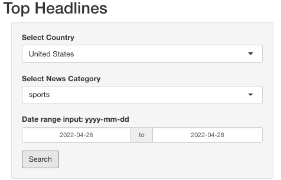
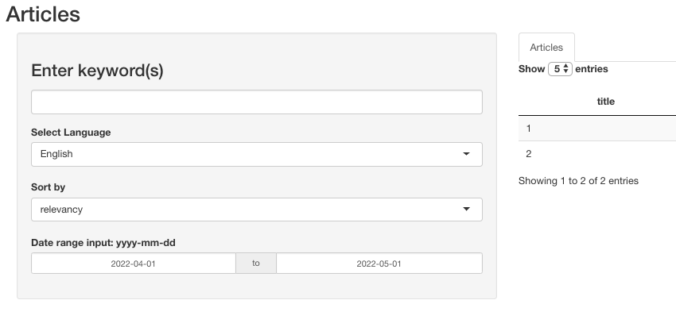

"woRldnews" is a R package that allows users to search for top news in 50 countries and millions of articles from over 80,000 large and small news sources and blogs in real time. Users can do relevant searches using two distinct "shiny" apps. Users may search top headlines in fifty countries with the first "shiny" app. Users can use the second app to search for articles that they are interested in fifteen languages. 

<<<<<<< HEAD

## Installation
>>>>>>> d2dbc5f82ed87e5e9903e5923cc32ebc5c850768

woRldnews can be installed with devtools to get the most recent production version from GitHub:

```{r}
<<<<<<< HEAD
install.packages('devtools') # if devtools is not already installed
devtools::install_github('eshitazaman/stat585-project')
>>>>>>> d2dbc5f82ed87e5e9903e5923cc32ebc5c850768
```

## Examples and Usage


Welcome to woRldnews! Before you can search for news and articles in R, you'll need to create a free account at [Newsapi.org] (https://newsapi.org) and acquire an apikey.


```{r}
library(woRldnews)
```

Newsapi will assign you an apikey. This apikey can be saved to you .Rprofile for future use. 

```{r}
newsapi_key <- "paste_key_here"
```

## Using woRldnews

To do relevant searches, woRldnews features two  "shiny" apps.
To search for news, you use runshiny function:

```{r}
runshiny("headlines")
```

When you run this function, you'll receive the shiny widget below: 



From the select boxes on the shiny.app, you select the country and category for the news search. You receive the search results in a table format with 20 top headlines including title, description, date, url, and url to image. By clicking the url you can access related websites. 


To search for articles, you use runshiny function:

```{r}
runshiny("articles")
```

When you run this function, you'll receive the shiny widget below: 

<<<<<<< HEAD


From the select boxes on the shiny.app, you enter the keyword, select the language and sort by for the articles search. You can narrow the search to specific dates within the previous 30 days.  
``
>>>>>>> d2dbc5f82ed87e5e9903e5923cc32ebc5c850768

You receive the search results in a table format with 20 top headlines including title, description, content, url, author and publication date. 

<<<<<<< HEAD


>>>>>>> d2dbc5f82ed87e5e9903e5923cc32ebc5c850768


## Vignettes

For more details, see the vignette.

## About Newsapi.org

The Newsapi.org is a basic, easy-to-use REST API that offers JSON search results for current and historical news stories from over 80,000 sources throughout the world. 


